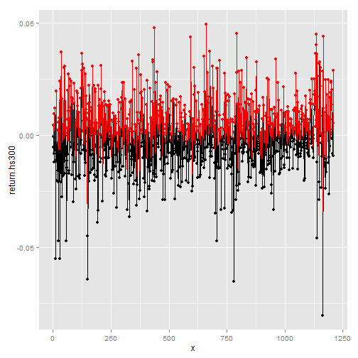
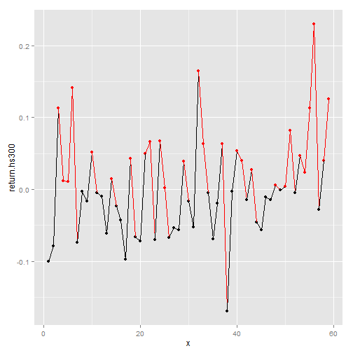
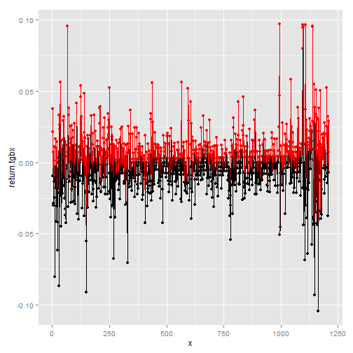
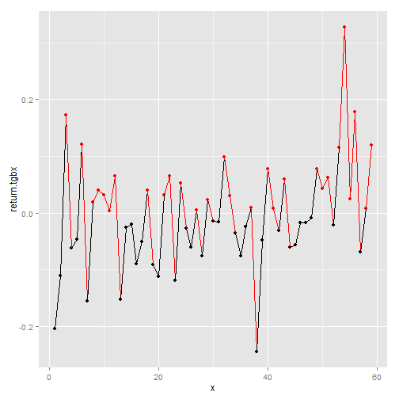

#######################################################################
数据来源：WIND数据库                                                 
所选取的指数：沪深300                                                
所选取的股票：太钢不锈                                               
所选取的时间：2010.4.1-2015.4.1                                      
#######################################################################

#一、沪深300日数据


```r
HS300<-read.csv("d:/study/SUFE/金融计量学/homework1/HS300Daily.csv")
hs300<-HS300[,5]
return.hs300<-diff(log(hs300))
n<-length(return.hs300)
I<-rep(0,times=1210)
I[return.hs300>0]<-1
```

##数据的基本统计性质

折线图


```r
library(ggplot2)
x<-1:1210
qplot(x,return.hs300,color=I+1,geom=c("point","path"))
```

 

均值


```r
mean(return.hs300)
```

```
## [1] 0.000146786
```

方差


```r
var(return.hs300)
```

```
## [1] 0.000194131
```

偏度


```r
library(e1071)
skewness(return.hs300)
```

```
## [1] -0.2340001
```

峰度


```r
kurtosis(return.hs300)
```

```
## [1] 2.514426
```

##基于顺序和反转的RW1的检验


```r
n<-length(return.hs300)
I<-rep(0,times=1210)
I[return.hs300>0]<-1
Y<-I[-1]*I[-length(I)]+(1-I[-1])*(1-I[-length(I)])
(Ns<-sum(Y))#number of sequences in sample
```

```
## [1] 614
```

```r
(Nr<-length(Y)-Ns)#number of reversals in sample
```

```
## [1] 595
```
基于第一种CJ估计方法

```r
(CJhat<-Ns/Nr)#Cowless-Jones Ratio in sample
```

```
## [1] 1.031933
```

```r
(pishat<-Ns/n)
```

```
## [1] 0.507438
```

```r
(pihat<-sum(I)/length(I))
```

```
## [1] 0.4983471
```

```r
(Asy.Var.CJhat<-(pishat*(1-pishat)+2*(pihat^3+(1-pihat)^3-pishat^2))/(n*(1-pishat)^4))
```

```
## [1] 0.003299071
```

```r
(Asy.E.CJhat<-pishat/(1-pishat))
```

```
## [1] 1.030201
```

```r
1-pnorm(CJhat,mean=Asy.E.CJhat,sd=sqrt(Asy.Var.CJhat))
```

```
## [1] 0.4879759
```
由假设检验的P值可知:我们没有足够的理由拒绝独立同分布的原假设，也即市场是有效的.

基于第二种CJ估计方法

```r
alpha<-0;beta<-0
for(i in 1:1209){
    j<-i+1
    if(I[i]==0 & I[j]==1){
        beta<-beta+1
    }
    if(I[i]==1 & I[j]==0){
        alpha<-alpha+1
    }
}
(alpha<-alpha/(sum(I[-length(I)]==1)))
```

```
## [1] 0.4941957
```

```r
(beta<-beta/(sum(I[-length(I)]==0)))
```

```
## [1] 0.490099
```

```r
(CJhat<-((1-alpha)*beta+(1-beta)*alpha)/(2*alpha*beta))
```

```
## [1] 1.031947
```

```r
1-pnorm(CJhat,mean=Asy.E.CJhat,sd=sqrt(Asy.Var.CJhat))
```

```
## [1] 0.4878772
```
由假设检验的P值可知：不拒绝原假设，也即市场是有效的

##基于游程的RW1的检验


```r
Nruns<-sum((diff(I))!=0)+1#numbers of runs
(z<-(Nruns+1/2-2*n*pihat*(1-pihat))/(2*sqrt(n*pihat*(1-pihat)*(1-3*pihat*(1-pihat)))))
```

```
## [1] -0.4883302
```

```r
pnorm(z)
```

```
## [1] 0.312658
```
由假设检验的P值可知:我们没有足够的理由拒绝独立同分布的原假设，也即市场是有效的.


#二、沪深300月数据


```r
HS300<-read.csv("d:/study/SUFE/金融计量学/homework1/HS300Monthly.csv")
hs300<-HS300[,5]
return.hs300<-diff(log(hs300))
n<-length(return.hs300)
I<-rep(0,times=59)
I[return.hs300>0]<-1
```

##数据的基本统计性质

折线图


```r
library(ggplot2)
x<-1:59
qplot(x,return.hs300,color=I+1,geom=c("point","path"))
```

 

均值


```r
mean(return.hs300)
```

```
## [1] 0.004715129
```

方差


```r
var(return.hs300)
```

```
## [1] 0.004979053
```

偏度


```r
library(e1071)
skewness(return.hs300)
```

```
## [1] 0.5852367
```

峰度


```r
kurtosis(return.hs300)
```

```
## [1] 0.8504223
```

##基于顺序和反转的RW1的检验


```r
n<-length(return.hs300)
I<-rep(0,times=59)
I[return.hs300>0]<-1
Y<-I[-1]*I[-length(I)]+(1-I[-1])*(1-I[-length(I)])
(Ns<-sum(Y))#number of sequences in sample
```

```
## [1] 29
```

```r
(Nr<-length(Y)-Ns)#number of reversals in sample
```

```
## [1] 29
```
基于第一种CJ估计方法

```r
(CJhat<-Ns/Nr)#Cowless-Jones Ratio in sample
```

```
## [1] 1
```

```r
(pishat<-Ns/n)
```

```
## [1] 0.4915254
```

```r
(pihat<-sum(I)/length(I))
```

```
## [1] 0.4576271
```

```r
(Asy.Var.CJhat<-(pishat*(1-pishat)+2*(pihat^3+(1-pihat)^3-pishat^2))/(n*(1-pishat)^4))
```

```
## [1] 0.07036296
```

```r
(Asy.E.CJhat<-pishat/(1-pishat))
```

```
## [1] 0.9666667
```

```r
1-pnorm(CJhat,mean=Asy.E.CJhat,sd=sqrt(Asy.Var.CJhat))
```

```
## [1] 0.4499994
```
由假设检验的P值可知:我们没有足够的理由拒绝独立同分布的原假设，也即市场是有效的.

基于第二种CJ估计方法

```r
alpha<-0;beta<-0
for(i in 1:58){
    j<-i+1
    if(I[i]==0 & I[j]==1){
        beta<-beta+1
    }
    if(I[i]==1 & I[j]==0){
        alpha<-alpha+1
    }
}
(alpha<-alpha/(sum(I[-length(I)]==1)))
```

```
## [1] 0.5384615
```

```r
(beta<-beta/(sum(I[-length(I)]==0)))
```

```
## [1] 0.46875
```

```r
(CJhat<-((1-alpha)*beta+(1-beta)*alpha)/(2*alpha*beta))
```

```
## [1] 0.9952381
```

```r
1-pnorm(CJhat,mean=Asy.E.CJhat,sd=sqrt(Asy.Var.CJhat))
```

```
## [1] 0.4571125
```
由假设检验的P值可知：不拒绝原假设，也即市场是有效的

##基于游程的RW1的检验


```r
Nruns<-sum((diff(I))!=0)+1#numbers of runs
(z<-(Nruns+1/2-2*n*pihat*(1-pihat))/(2*sqrt(n*pihat*(1-pihat)*(1-3*pihat*(1-pihat)))))
```

```
## [1] 0.3133245
```

```r
pnorm(z)
```

```
## [1] 0.6229829
```
由假设检验的P值可知:我们没有足够的理由拒绝独立同分布的原假设，也即市场是有效的.


#三、太钢不锈日数据


```r
TGBX<-read.csv("d:/study/SUFE/金融计量学/homework1/TGBXDaily.csv")
tgbx<-TGBX[,5]
return.tgbx<-diff(log(tgbx))
n<-length(return.tgbx)
I<-rep(0,times=1210)
I[return.tgbx>0]<-1
```

##数据的基本统计性质

折线图


```r
library(ggplot2)
x<-1:1210
qplot(x,return.tgbx,color=I+1,geom=c("point","path"))
```

 

均值


```r
mean(return.tgbx)
```

```
## [1] -0.0003085544
```

方差


```r
var(return.tgbx)
```

```
## [1] 0.0003740434
```

偏度


```r
library(e1071)
skewness(return.tgbx)
```

```
## [1] 0.3483054
```

峰度


```r
kurtosis(return.tgbx)
```

```
## [1] 5.963947
```

##基于顺序和反转的RW1的检验


```r
n<-length(return.tgbx)
I<-rep(0,times=1210)
I[return.tgbx>0]<-1
Y<-I[-1]*I[-length(I)]+(1-I[-1])*(1-I[-length(I)])
(Ns<-sum(Y))#number of sequences in sample
```

```
## [1] 590
```

```r
(Nr<-length(Y)-Ns)#number of reversals in sample
```

```
## [1] 619
```
基于第一种CJ估计方法

```r
(CJhat<-Ns/Nr)
```

```
## [1] 0.9531502
```

```r
(pishat<-Ns/n)
```

```
## [1] 0.4876033
```

```r
(pihat<-sum(I)/length(I))
```

```
## [1] 0.4520661
```

```r
(Asy.Var.CJhat<-(pishat*(1-pishat)+2*(pihat^3+(1-pihat)^3-pishat^2))/(n*(1-pishat)^4))
```

```
## [1] 0.003454301
```

```r
(Asy.E.CJhat<-pishat/(1-pishat))
```

```
## [1] 0.9516129
```

```r
1-pnorm(CJhat,mean=Asy.E.CJhat,sd=sqrt(Asy.Var.CJhat))
```

```
## [1] 0.489566
```
由假设检验的P值可知:我们没有足够的理由拒绝独立同分布的原假设，也即市场是有效的.

基于第二种CJ估计方法

```r
alpha<-0;beta<-0
for(i in 1:1209){
    j<-i+1
    if(I[i]==0 & I[j]==1){
        beta<-beta+1
    }
    if(I[i]==1 & I[j]==0){
        alpha<-alpha+1
    }
}
(alpha<-alpha/(sum(I[-length(I)]==1)))
```

```
## [1] 0.5667276
```

```r
(beta<-beta/(sum(I[-length(I)]==0)))
```

```
## [1] 0.4667674
```

```r
(CJhat<-((1-alpha)*beta+(1-beta)*alpha)/(2*alpha*beta))
```

```
## [1] 0.9534555
```

```r
1-pnorm(CJhat,mean=Asy.E.CJhat,sd=sqrt(Asy.Var.CJhat))
```

```
## [1] 0.487495
```
由假设检验的P值可知：不拒绝原假设，也即市场是有效的

##基于游程的RW1的检验


```r
Nruns<-sum((diff(I))!=0)+1#numbers of runs
(z<-(Nruns+1/2-2*n*pihat*(1-pihat))/(2*sqrt(n*pihat*(1-pihat)*(1-3*pihat*(1-pihat)))))
```

```
## [1] 1.200056
```

```r
1-pnorm(z)
```

```
## [1] 0.1150589
```
由假设检验的P值可知:我们没有足够的理由拒绝独立同分布的原假设，也即市场是有效的.


#三、太钢不锈日数据


```r
TGBX<-read.csv("d:/study/SUFE/金融计量学/homework1/TGBXMonthly.csv")
tgbx<-TGBX[,5]
return.tgbx<-diff(log(tgbx))
n<-length(return.tgbx)
I<-rep(0,times=59)
I[return.tgbx>0]<-1
```

##数据的基本统计性质

折线图


```r
library(ggplot2)
x<-1:59
qplot(x,return.tgbx,color=I+1,geom=c("point","path"))
```

 

均值


```r
mean(return.tgbx)
```

```
## [1] -0.003690888
```

方差


```r
var(return.tgbx)
```

```
## [1] 0.008754184
```

偏度


```r
library(e1071)
skewness(return.tgbx)
```

```
## [1] 0.4421472
```

峰度


```r
kurtosis(return.tgbx)
```

```
## [1] 1.793196
```

##基于顺序和反转的RW1的检验


```r
n<-length(return.tgbx)
I<-rep(0,times=59)
I[return.tgbx>0]<-1
Y<-I[-1]*I[-length(I)]+(1-I[-1])*(1-I[-length(I)])
(Ns<-sum(Y))#number of sequences in sample
```

```
## [1] 29
```

```r
(Nr<-length(Y)-Ns)#number of reversals in sample
```

```
## [1] 29
```
基于第一种CJ估计方法

```r
(CJhat<-Ns/Nr)
```

```
## [1] 1
```

```r
(pishat<-Ns/n)
```

```
## [1] 0.4915254
```

```r
(pihat<-sum(I)/length(I))
```

```
## [1] 0.4745763
```

```r
(Asy.Var.CJhat<-(pishat*(1-pishat)+2*(pihat^3+(1-pihat)^3-pishat^2))/(n*(1-pishat)^4))
```

```
## [1] 0.06861481
```

```r
(Asy.E.CJhat<-pishat/(1-pishat))
```

```
## [1] 0.9666667
```

```r
1-pnorm(CJhat,mean=Asy.E.CJhat,sd=sqrt(Asy.Var.CJhat))
```

```
## [1] 0.4493699
```
由假设检验的P值可知:我们没有足够的理由拒绝独立同分布的原假设，也即市场是有效的.

基于第二种CJ估计方法

```r
alpha<-0;beta<-0
for(i in 1:58){
    j<-i+1
    if(I[i]==0 & I[j]==1){
        beta<-beta+1
    }
    if(I[i]==1 & I[j]==0){
        alpha<-alpha+1
    }
}
(alpha<-alpha/(sum(I[-length(I)]==1)))
```

```
## [1] 0.5185185
```

```r
(beta<-beta/(sum(I[-length(I)]==0)))
```

```
## [1] 0.483871
```

```r
(CJhat<-((1-alpha)*beta+(1-beta)*alpha)/(2*alpha*beta))
```

```
## [1] 0.997619
```

```r
1-pnorm(CJhat,mean=Asy.E.CJhat,sd=sqrt(Asy.Var.CJhat))
```

```
## [1] 0.4529689
```
由假设检验的P值可知：不拒绝原假设，也即市场是有效的

##基于游程的RW1的检验


```r
Nruns<-sum((diff(I))!=0)+1#numbers of runs
(z<-(Nruns+1/2-2*n*pihat*(1-pihat))/(2*sqrt(n*pihat*(1-pihat)*(1-3*pihat*(1-pihat)))))
```

```
## [1] 0.2795182
```

```r
1-pnorm(z)
```

```
## [1] 0.3899236
```
由假设检验的P值可知:我们没有足够的理由拒绝独立同分布的原假设，也即市场是有效的.


#######################################################################
疑问：既然以上不论是指数或者股票的日或月数据都表明市场是有效的，也即 
我们无法基于历史数据预测未来数据，那我们如何套利呢？难道就随机猜嘛？ 
#######################################################################

